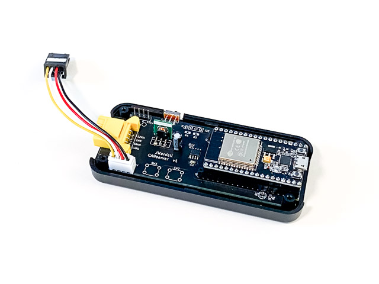

## CANserver
Arduino software for CANserver board and microDisplay

http://www.jwardell.com/canserver

**Please see all documentation in docs subdirectory**

Please see this thread for development discussion:
https://teslaownersonline.com/threads/canserver-development.16373/

TODO list for the near future:

~~* Customization of CAN messages and signals - grab string from serial or web and convert to message ID, bits, scale, units, etc.~~

~~* Customization of each display - assingning signals, format, etc~~

~~* Saving these customizations to onboard eeprom~~

~~* A simple web page served to enter these configurations - pull up 192.168.4.1 on your phone and fill in a few fields~~

* Logically standardize this to be handled by external phone or PC tools in the future over wifi

Other goodies on the soon list:
* ~~Dump CAN logs to SD Card~~, if configured, triggered by pushbutton etc
~~* Reprogram over Wifi - Jake is on this already~~
* PC or phone tool to choose signals from a DBC file and send over their config
* ~~Passing data over wifi to phone apps like TesLax~~ and ScanMyTesla as a much higher bandwidth alternative to bluetooth OBD tools (on multiple busses from multiple canserves while I dream)

Whishlist for the further future:
* Long term time and signal filtered contiuous can logs...think Teslafi with thousands of signals
~~* Auto-connect to home wifi and server~~ to dump logs etc
* Integration with something like Teslogger to cloud process that data
* Support for many more vehicles with CAN
