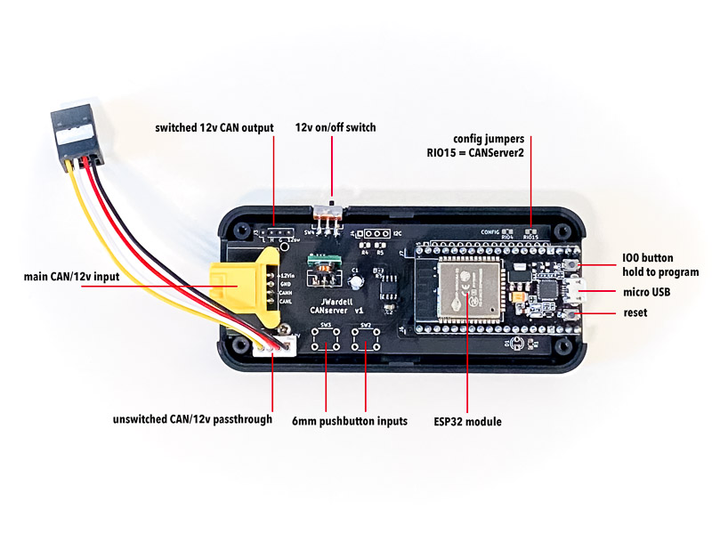
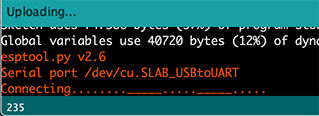

## CANserver Manual

CANserver is intended to connect to a CAN network and transmit live data to a microDisplay, but has many more potential uses! It has a powerful ESP32 board with WiFi and Bluetooth and is Arduino programmable.

### Installation

CANserver should be connected to your CAN network with a supplied cable harness.

**Tesla powertrain bus**

Use the OBD harness to connect to your car's built-in (2020+) OBD connector, or you will need to buy a 3rd party OBD harness that plugs behind the center console.

(more)

**Tesla chassis bus**

The CANserver is designed to plug and play easily under the passenger seat! Raise the seat to full height and look for a small box with a yellow connector. While the car is in Park, squeeze and pull to release the cable from the seat box. Plug it into the CANserver and plug the chassis pass-through cable into the seat box. Use the included double sized foam to mount the CANserver under the seat.

(images)

**Setup of data**

In the futre hopefully you will able to easily choose what data to display on your microDisplays. Until then, it must be hardcoded into the Arduino program. (stay tuned!)

### Hardware overview

CANserver is based around a common ESP32 board that is powerful and easily programmed with Arduino.

There are three 12v+CAN connections--the left and bottom are hardwired for pass-through, and the top's 12v line is after the power switch. These are designed to support various CAN harnesses, and options should be available for OBDII, Tesla Chassis, DB9, or make your own using the standard SIP pins or XPH connectors.

After the power switch, there is a 7-30v to 5v switching regulator powering the rest of the board.

Next there is a CAN tranceiver, which is pulled high in hardware as shipped to disable transmission for customer confidence that this system can not negatively affect their vehicle. Enabling transmission can be dangerous and the user accepts all responsibility.

There are two configuration resistor pads (these will be jumpers in the future). RIO15 is used to configure as "CANServer2" SSID at startup so that two CANservers can be installed on two different CANbusses simultaneously. The second pad is for future use.

There is space to add your own pushbutton inputs, LED outputs, and I2C connector.

## Arduino programming and configuration

**Setup**

The board uses the standard Node32S ESP32 Arduino board. 

In Arduino Preferences, add the following to your Board Manager URLs:

    https://dl.espressif.com/dl/package_esp32_index.json

Then under Board Manager, install *esp32 by Espressif Systems*

Under Boards, select Node32S

You may need to install the Silabs USB drivers at https://www.silabs.com/products/development-tools/software/usb-to-uart-bridge-vcp-drivers

**Programming**

When uploading your program, once you see *Connecting...* **you must hold down the IO0 boot button** (to the right of the right of the USB cable) for ~2sec in order to start downloading.

Jun 5, 2020
