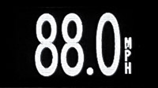

## microDisplay commands

Each microDisplay connects to the CANserver with a display number depending on its jumper configuration. The CANserver feeds it a one-line String with the latest data to display as well as configuration and display modes. Numerical and uppercase textual data is followed by a lower case letter describing that data's type.

Most of the time, the server can simply send the value and unit to display in the default mode. For example:

        disp0str = "880vHPMu";

will display 88.0MPH:

Note that mode-0 values are divided by 10 with decimal and negative automatically drawn, and units start from the bottom-right corner so are sent in reverse order.

Here is the current list of microDisplay command characters:

- **m** display mode - see description of display modes below. Changing mode clears screen.
- **v** mode-0 value to display * 10
- **u** mode-0 units - uppercase characters starting from the bottom left (in reverse order)
  - D is replaced with a degree symbol in the top-right
- **b** bargraph - -24 to 24 LEDs to show on I2C bar graph meter, positive red, negative green
  - 25 to 48 will draw a yellow bar `[rev >= 20200805]`
  - Individual LEDs can be drawn with 101-124 (red) 201-224 (green) 301-324 (yellow) `[rev >= 20200805]`
- **l** LEDs - sets the left and right GPIOs
  - I for input, 1 or 0 for output. Examples: 00l IIl I0l 10l
  - Can PWM dim left LED with values 2-6  `[rev >= 20200805]`
  - Note the left GPIO is 3.3v output/tolerant, right GPIO is 5v output/tolerant
  - these are typically pushbuttons or LEDs soldered on the left or right boards, or relay on right board
- **t** text - Text to be shown in text mode. Should be uppercase unless lower case is not used in this list
- **s** size - font size multiplier for text
- **c** color - specifies text or graph color (value mode is always white)
  - 65535 white 63488 red 1024 green 31 blue 64800 orange 65504 yellow
- **o** orientation - 0 for default, 1 to flip (upside-down), 2 and 3 for vertical (only useful for text mode) `[rev >= 20200719]`
- **a** alphadisplay1 - value to show on alphanumeric LED display 1
  - four characters, or four plus decimal point. Examples: "-123.4" "  20" "10KW" "JERK"
- **d** alphadisplay2 - value to show on alphanumeric LED display 2
- **x** I2Cbrightness - sets brightness of bargraph or alphanumeric I2C displays 0-15 (can't change microDisplay brightness)
- **r** refresh rate - delay in ms between microDisplay requests for new CANserver data and display update. Default is 200

While the microDisplay defaults to the full-height value display, there are other display modes:

- **0** default graphical white value display
  - displays numeric value v signed with decimal plus units u
  - values over 9999 will be chopped, can add 10000 to value to display without decimal `[rev >= 20200805]`
- **1** Text display - prints text preceding the t in the string, font size s, color c, line-wrapped.
  - size 1 fits 17 characters x 5 lines, size 2 8char x 2lines, s3-5char x1, s4...
- **5** left-scrolling graph of values v with color c on black
  - pre-scale the value the 8-pixel display height, drawn from the bottom right
  - negative values will be drawn down from the top
- **6** display left or right arrows with color c
  - value 0=none 1=left 2=right 3=both intended as an alternative to LEDs on extra boards for blindspot display etc
- **99** this mode is shown when disconnected from the CANserver WiFi
  - Displays SSID and display number as configured by jumpers
  - Small bottom line shows firmware rev date, wifi state, and status of left and right GPIOs

The display will http post the values of the left and right GPIOs to /post0 /post1 etc as "11" "01" etc. This will be followed by r and the revdate  `[rev >= 20200621]`

Document updated Aug 5 2020 for 20200805 firmware

http://www.jwardell.com/microdisplay

