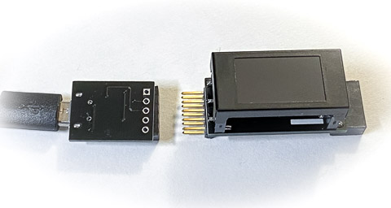
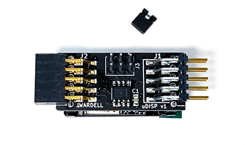
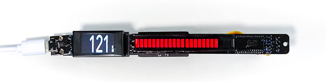
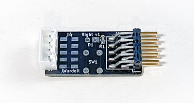
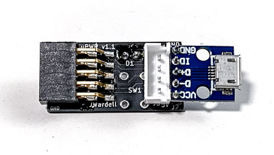

## microDisplay Manual

The microDisplay is a tiny wireless data display that connects to a CANserver. It's also a modular system that supports multiple displays, bargraphs, LEDs, buttons, and more.

While the display itself is feature complete, the smarts in the server are just starting development. The server can be programmed with Arduino to customize functionality, sending commands to multiple displays. In the future, the server and displays could easily be configured with a phone or web browser.

### Installation

If you have just one display and server, they will connect to each other out of the box. 
The most basic setup with one display is powered by a small USB adapter on its left. Note the correct orientation with a red dot on the back. Plug the USB cable into any standard USB port, hide the cable if you wish, and you are done.

Initially there are also "left" and "right" boards that connect to the sides of the display and offer multiple options depending on how they are built. They connect to the bargraph display, or contain LEDs or buttons. Plug these in as desired before plugging power. More detail on these boards are in the technical section below.

If you have multiple microDisplays, you can configure them with jumpers on the back. They configure the display number [0-3] and if it should connect to a second WiFi CANserver. 

        ::: server 1, display 0
        ::| server 1, display 1
        :|: server 1, display 2
        :|| server 1, display 3
        |:: server 2, display 0
        |:| server 2, display 1

When the display starts up, before it connects to a server, it will show its configuration on the screen.

### Modes

In addition to the main data signal mode, the microDisplay supports text, scrolling graphs, and a few other options. See the separate displaycommands document for technical detail on the display modes and how to program and communicate with the microDisplay. Eventually these will just be presented as configuration options.

### Optional boards tech info

**! Please make sure boards are plugged in the proper orienation before powering up--with the connectors on the back!**

**24-LED bargraph**

Though I may design a dedicated board for this in the future, this starts with an Adafruit bargraph I2C backpack. I paint the front black, add a black filter sheet, and include a left or right board to the back so it can connect to the microDisplay. You are welcome to build, customize, and add your own! Each display supports one bargraph.

**Right board**

This board plugs into the right of the display. It has an I2C connector for a bargraph. It may also have an LED and/or a 6mm pushbutton depending on your custom order, or you may add your own. These are driven by the 5v right GPIO from the display. You can have the LED on the board so it shines next to the display, or wire a remote LED to hide elsewhere. If configured, the board can also have a connector to plug another display on its right; only 5V USB power is passed to that connector.

**Left board**

This board plugs into the left of the display. It has an I2C connector for a bargraph. It may also have an LED or a 6mm pushbutton depending on your custom order, or you may add your own. These are driven by the 3.3v left GPIO from the display. You can have the LED on the board so it shines next to the display, or wire a remote LED to hide elsewhere. This board also has a USB connector to be used instead of the USB-only power connector.

**Alphanumeric LED**

Coming soon or add your own, support for two BTTF-style LED displays, based on the Adafruit quad alphanumeric I2C backpack. (These won't fit in the 16mm height of the Tesla air vent)

Jun 7, 2020
